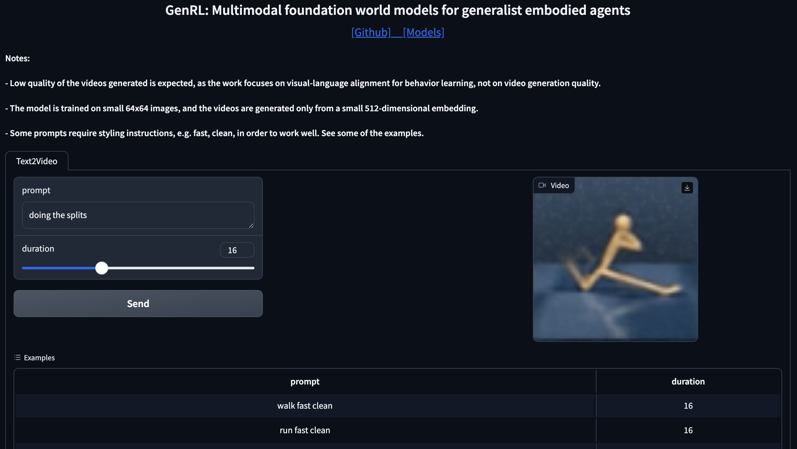

# GenRL: Multimodal-foundation world models for generalization in embodied agents

<p align="center">
    
</p>

<p align="center">
         <a href="https://mazpie.github.io/genrl">Website</a>&nbsp | <a href="https://huggingface.co/mazpie/genrl_models"> Models 🤗</a>&nbsp | <a href="https://huggingface.co/datasets/mazpie/genrl_datasets"> Datasets 🤗</a>&nbsp | <a href="./demo/"> Gradio demo</a>&nbsp | <a href="./notebooks/"> Notebooks</a>&nbsp
<br>

If you found our code useful, please refer to our work using the following citation:

```
@inproceedings{Mazzaglia2024GenRL,
    title={Gen{RL}: Multimodal-foundation world models for generalization in embodied agents},
    author={Pietro Mazzaglia and Tim Verbelen and Bart Dhoedt and Aaron Courville and Sai Rajeswar},
    booktitle={The Thirty-eighth Annual Conference on Neural Information Processing Systems},
    year={2024},
    url={https://openreview.net/forum?id=za9Jx8yqUA}
}
```

## 📰 Updates 

* `September 2024`: GenRL got accepted to NeurIPS 2024 
* `July 2024`: the GenRL work was awarded the "Outstanding Paper Award" at the [MFM-EAI workshop](https://icml-mfm-eai.github.io/) @ ICML 2024 

## Get started

### Creating the environment

We recommend using `conda` to create the environment

```
conda create --name genrl python=3.10

conda activate genrl

pip install -r requirements.txt
```

### Downloading InternVideo2

Download InternVideo 2 [[here]](https://huggingface.co/OpenGVLab/InternVideo2-Stage2_1B-224p-f4/blob/main/InternVideo2-stage2_1b-224p-f4.pt).

Place in the `models` folder.

Note: the file access is restricted, so you'll need an HuggingFace account to request access to the file.

Note: By default, the code expects the model to be placed in the `models` folder. The variable `MODELS_ROOT_PATH` indicating where the model should be place is set in `tools/genrl_utils.py`.

## Data

### Download datasets

The datasets used to pre-trained the models can be downloaded [[here]](https://huggingface.co/datasets/mazpie/genrl_datasets).

The file are `tar.gz` and can be extracted using the `tar` utility on Linux. For example:

```
tar -zxvf walker_data.tar.gz
```

### Collecting and pre-processing data

If you don't want to download our datasets, you collect and pre-process the data on your own.

Data can be collected running a DreamerV3 agent on a task, by running:

```
python3 collect_data.py agent=dreamer task=stickman_walk
```

or the Plan2Explore agent, by running:

```
python3 collect_data.py agent=plan2explore conf/defaults=dreamer_v2 task=stickman_walk
```

A repo for the experiment will be created under the directory `exp_local`, such as: `exp_local/YYYY.MM.DD/HHMMSS_agentname`. The data can then be found in the `buffer` subdirectory.


After obtaining the data, it should be processed to obtain the video embeddings for each frame sequence in the episodes. The processing can be done by running:

```
python3 process_dataset.py dataset_dir=data/stickman_example
```

where `data/stickman_example` is replaced by the folder of the data you want to process.

## Agents 

### Downloading pre-trained models

If you want to test our work, without having to pre-train the models, you can do this by using our pre-trained models.

Pretrained models can be found [[here]](https://huggingface.co/mazpie/genrl_models)

Here's a snippet to download them easily:

```
import os
from huggingface_hub import hf_hub_download

def download_model(model_folder, model_filename):
    REPO_ID = 'mazpie/genrl_models'
    filename_list = [model_filename]
    if not os.path.exists(model_folder):
        os.makedirs(model_folder)
    for filename in filename_list:
        local_file = os.path.join(model_folder, filename)
        if not os.path.exists(local_file):
            hf_hub_download(repo_id=REPO_ID, filename=filename, local_dir=model_folder, local_dir_use_symlinks=False)

download_model('models', 'genrl_stickman_500k_2.pt')
```

Pre-trained models can be used by setting `snapshot_load_dir=...` when running `train.py`.

Note: the pre-trained models are not trained to solve any tasks. They only contain a pre-trained multimodal-foundation world model (world model + connector and aligner).

### Training multimodal-foundation world models

In order to train a multimodal-foundation world model from data, you should run something like:

```
# Note: frames = update steps


python3 train.py task=stickman_walk replay_load_dir=data/stickman_example num_train_frames=500_010 visual_every_frames=25_000 train_world_model=True train_connector=True reset_world_model=True reset_connector=True
```

### Behavior learning

After pre-training a model, you can train the behavior for a task using:


#### From language prompts
```
python3 train.py task=stickman_walk snapshot_load_dir=models/genrl_stickman_500k_2.pt num_train_frames=50_010 batch_size=32 batch_length=32 agent.imag_reward_fn=video_text_reward eval_modality=task_imag 
```

#### From video prompts
```
python3 train.py task=stickman_walk snapshot_load_dir=models/genrl_stickman_500k_2.pt num_train_frames=50_010 batch_size=32 batch_length=32 agent.imag_reward_fn=video_video_reward eval_modality=task_imag 
```

The evaluation of the agent happens at regular interval during behavior learning.

Data-free RL can be performed by additionaly passing the option:

`train_from_data=False`

The prompts for each task can be found and edited in `tools/genrl_utils.py`. However, you can also pass a custom prompt for a task by passing the option:

`+agent.imag_reward_args.task_prompt=custom_prompt`

## Other utilities

### Gradio demo

There's a gradio demo that can be found at `demo/app.py`.

If launching demo like a standard Python program with:

```
python3 demo/app.py
```

it will return a local endpoint (e.g. http://127.0.0.1:7860) where to access a dashboard to play with GenRL.

<p align="center">
    
</p>

### Notebooks

You can find several notebooks to test our code in the `notebooks` directory.

`demo_videoclip` : can be used to test the correct functioning of the InternVideo2 component

`text2video` : utility to generate video reconstructions from text prompts

`video2video` : utility to generate video reconstructions from video prompts

`visualize_dataset_episodes` : utility to generate videos from the episodes in a given dataset

`visualize_env` : used to play with the environment and, for instance, understand how the reward function of each task works

### Stickman environment

<p align="center">
    
</p>

We introduced the Stickman environment as a simplified 2D version of the Humanoid environment.

This can be found in the `envs/custom_dmc_tasks` folder. You will find an `.xml` model and a `.py` files containing the tasks.

## Acknowledgments

We would like to thank the authors of the following repositories for their useful code and models:

* [InternVideo2](https://github.com/OpenGVLab/InternVideo)
* [Franka Kitchen](https://github.com/google-research/relay-policy-learning)
* [DreamerV3](https://github.com/danijar/dreamerv3)
* [DreamerV3-torch](https://github.com/NM512/dreamerv3-torch)
